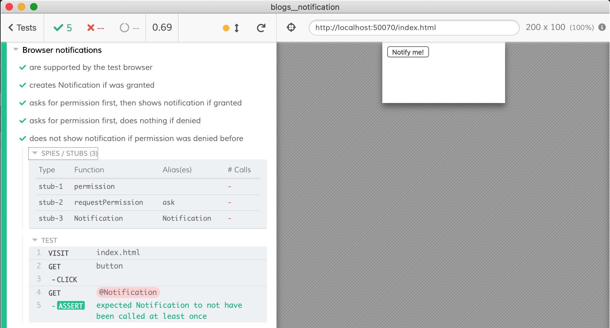
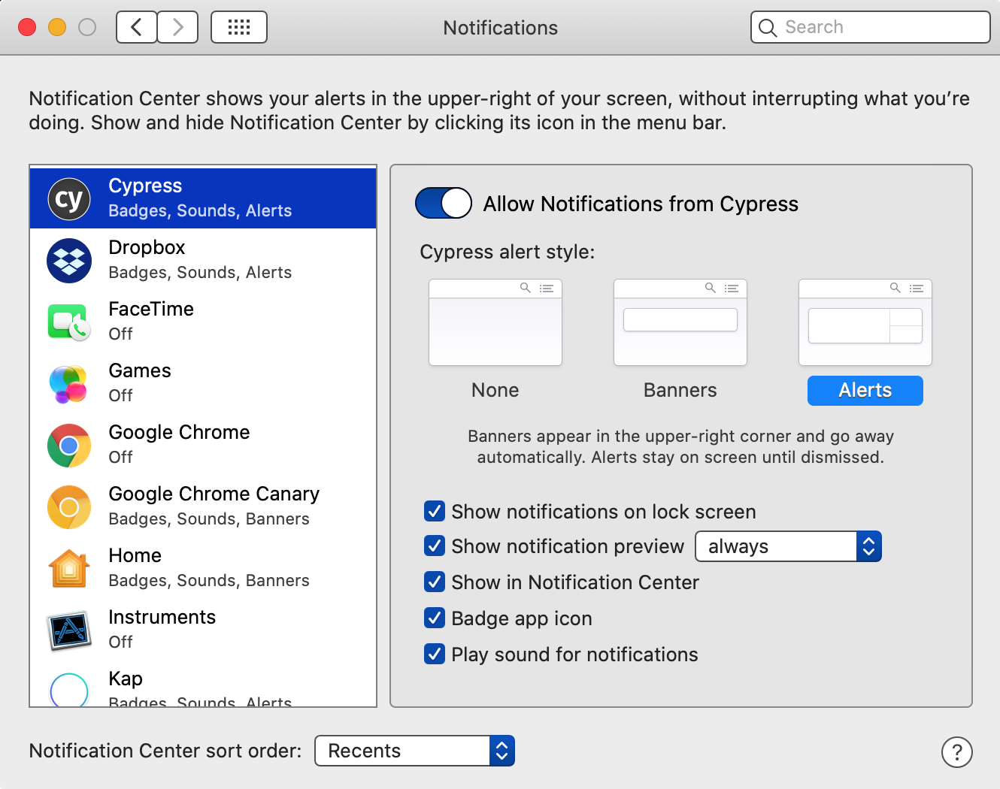
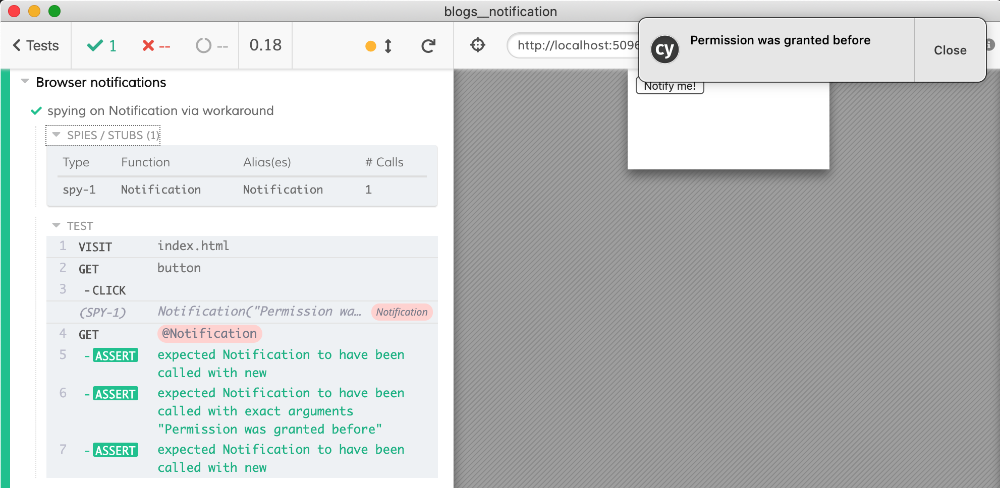

# Testing browser notifications

You can find the sample app in [index.html](index.html) and all tests in [cypress/integration/spec.js](cypress/integration/spec.js). The tests spy / stub Notification function in various ways to check how the app handles:
- permission was granted before
- permission was denied before
- permission was neither granted nor denied before, so the app asks the user and acts depending on the answer



## Checking if the browser supports notifications

The first test just checks that the browser supports notifications

```js
it('are supported by the test browser', () => {
  cy.visit('index.html')
  cy.window().should('have.property', 'Notification').should('be.a', 'function')
})
```

If you enable notifications from Cypress itself, you will see a popup if you click "Notify me!" button.




The rest of the tests stubs Notification constructor to avoid popups

## Cannot use spy

⚠️ In the tests we use `cy.stub(win, 'Notification')` and not `cy.spy(win, 'Notification')` because the [Sinon.js spy](https://on.cypress.io/spy) Cypress creates does not call the original function with `new` keyword.


Cypress issue [#6129](https://github.com/cypress-io/cypress/issues/6129)

### Workaround - spy via wrapper

To solve the above problem, we can wrap the native `Notification` constructor with our own function that always calls the problematic constructor using `new` keyword.

```js
it('spying on Notification via workaround', () => {
  cy.visit('index.html', {
    onBeforeLoad (win) {
      // let's wrap Notification constructor
      // to make sure it is always called with "new" keyword
      const _Notification = win.Notification

      win.Notification = function MockNotification (text) {
        // use "new" when calling true Notification
        return new _Notification(text)
      }

      // and copy the rest of the important properties
      win.Notification.requestPermission = _Notification.requestPermission
      win.Notification.permission = 'granted'

      // now spy on the wrapped Notification method
      cy.spy(win, 'Notification').as('Notification')
    },
  })

  cy.get('button').click()
  cy.get('@Notification')
  .should('have.been.calledWithNew')
  .and('have.been.calledWithExactly', 'Permission was granted before')
  .and('have.been.calledWithNew')
})
```



See the actual notification popup during test visible in the screenshot.


## See also

- Cypress guide to [Stubs, spies and clocks](https://on.cypress.io/stubs-spies-and-clocks)
- Read [Mozilla Notification page](https://developer.mozilla.org/en-US/docs/Web/API/Notification)
- [`cy.stub`](https://on.cypress.io/stub)
